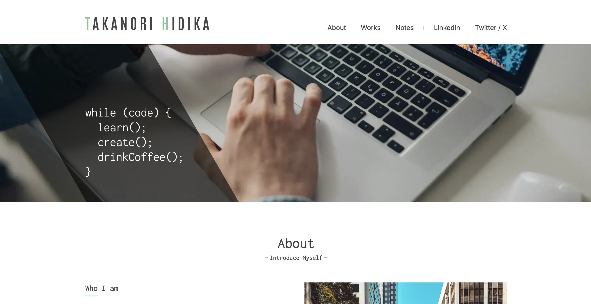
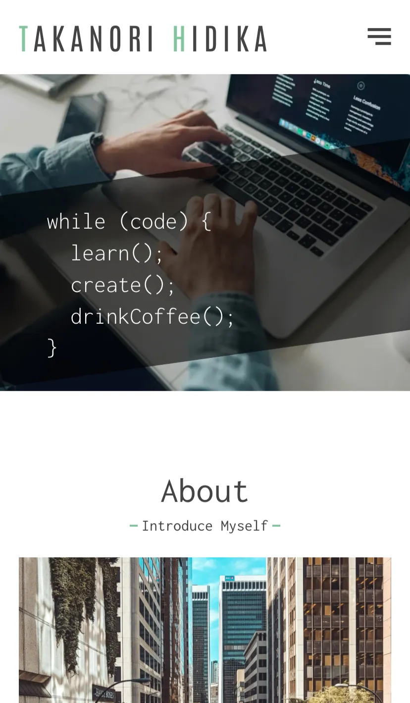

# TAKANORI HIDAKA - Personal Portfolio Landing Site

<div align="center">
  
  
  <br><br>
  <a href="https://takanori-hidaka.vercel.app/" target="_blank">
    
  </a>
  <br><br>
  <p>
    <a href="#overview">Overview</a> •
    <a href="#what-i-learned">What I Learned</a> •
    <a href="#tech-stack">Tech Stack</a> •
    <a href="#installation">Installation</a> •
    <a href="#license">License</a>
  </p>
</div>
<br>

## Overview

This is my personal portfolio landing site. It brings together a set of **Works** (portfolio, case studies) and **Notes** (brief showcases of what I’ve learned, small experimental projects) in one place. Built with **Next.js (App Router)** and **Tailwind CSS**, the site fetches content from **microCMS** and is deployed to **Vercel** with GitHub Actions.

The goal is to create a central place to showcase my portfolio projects and learning progress, while also building experience with modern development practices such as creating a site with Next.js, setting up testing, automating deployments with GitHub Actions, and integrating a headless CMS (microCMS) for scalable content management.

<br>

## What I Learned

- Created the site’s initial design in Figma. While not a deep dive into UI/UX theory, it was valuable to design and prototype on my own.
- Learned the importance of deciding the Node.js version before starting a project, while setting up GitHub Actions workflows.
- Configured deployment to Vercel via GitHub Actions, using the Vercel CLI instead of linking the repository directly.
- Set up ESLint for a Next.js project (different from my previous React + Vite setup).
- Integrated Google Fonts with Tailwind CSS in Next.js.
- Explored data fetching patterns in Next.js, including utility functions, API Routes, and Server Actions.
- Configured testing in a Next.js environment and learned considerations specific to Next.js (e.g., mocking `Image` and `Link`, differences between pages and components).
- Connected microCMS with Next.js for headless content management.
- Implemented URL-based state management with `useRouter` to persist list view state when navigating back from a detail page, avoiding the reset that happens with `useState` alone.

<br>

## Tech Stack

<table>
  <tr>
    <th>Frontend</th>
    <td>
      
      
      
      
    </td>
  </tr>
  <tr>
    <th>Backend</th>
    <td>
      
    </td>
  </tr>
  <tr>
    <th>Code Quality</th>
    <td>
      
      
      
    </td>
  </tr>
  <tr>
    <th>Testing</th>
    <td>
      
      
    </td>
  </tr>
  <tr>
    <th>Deployment</th>
    <td>
      
      
    </td>
  </tr>
  <tr>
    <th>Tools</th>
    <td>
      
    </td>
  </tr>
</table>
<br>

## Installation

If you want to run this project locally, clone the repository and install the dependencies:

```bash
git clone https://github.com/hidaka88jp/portfolio--personal-site
cd portfolio--personal-site
npm install
```

Please create your own microCMS service and obtain the API keys required for the environment variables.

Then, create a .env.local file in the root directory and add your environment variables:
```
MICROCMS_SERVICE_DOMAIN=your_service_domain
MICROCMS_API_KEY=your_api_key
```

Finally, start the development server:
```bash
npm run dev
```
<br>

## License

This project was created for educational and portfolio use.  
Licensed under the [MIT License](./LICENSE). 

